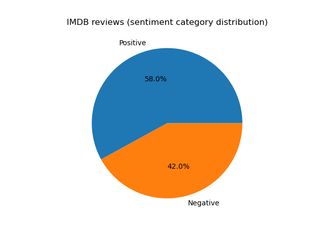
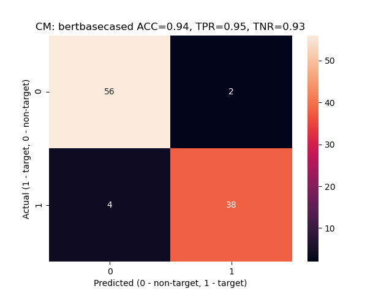
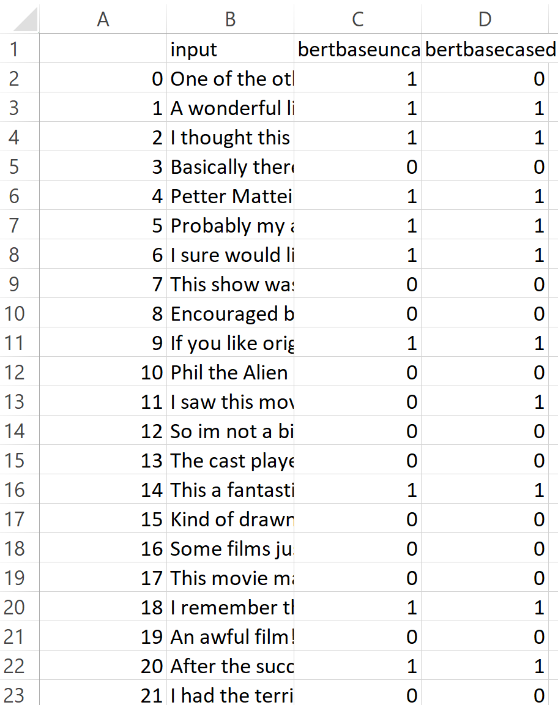
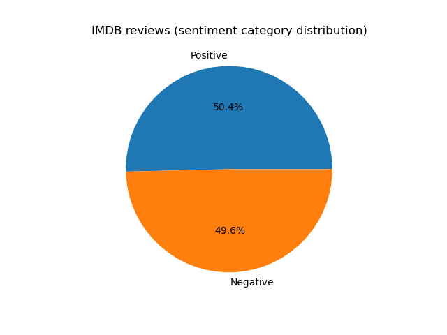

# Sentiment Analysis
# About

This repository contains a sentiment analysis solution template. `NLP.py` implements training/testing and (batch) predicting. `app.py` implements a Flask endpoint definition for sending sentiment prediction requests corresponding to ad-hoc reviews. `curl.txt` contains examples of sentiment predictions requests.

# Acknowledgements

The following repository has been an accelerator: [https://github.com/haldersourav/imdb-nlp-sentiment](https://github.com/haldersourav/imdb-nlp-sentiment)

# Prerequisites

The following components are recommended prerequisites:

- [Python 3.6.7](https://www.python.org/downloads/release/python-367/)
- [NVIDIA CUDA Toolkit 10.1](https://developer.nvidia.com/cuda-10.1-download-archive-base)
- [NVIDIA cuDNN](https://developer.nvidia.com/cudnn)

# Installation

(1) Clone/download/unzip this repository in the working folder of your choice (you must have read, write and execute rights in it).

(2) Using the OS terminal, navigate to the working folder and type: `pip install -r requirements.txt`

(3) Unzip into the working folder the `IMDB-trainvalidate.zip` archive

(4) Unzip into the `bert-base-cased` subfolder of the working folder the `pytorch_model.zip` archive (represented by multiple volumes)

(5) Unzip into the `bert-base-uncased` subfolder of the working folder the `pytorch_model.zip` archive (represented by multiple volumes)

(6) Substitute the `C:\Users\serge\eclipse-workspace\NLP\` strings in `NLP.py` and `app.py` with the OS path to your working folder

# Running
## Ad-hoc sentiment prediction requests

(1) Open an OS terminal session and start Flask in it (change the path to match your working folder):

 `cd C:\Users\serge\eclipse-workspace\NLP`
 
 `flask run`
 
 (2) Open another (separate from the previous) OS terminal session and type (or copy/paste another example from `curl.txt`) a sentiment prediction request (press Enter to send the request to Flask):
 
 `curl localhost:5000/predict -d "[{\"review\": \"I could barely finish it.\"}]" -H "Content-Type: application/json"` 

(3) Review the response returned by Flask

## Batch sentiment prediction

(1) Execute the following portions from `NLP.py`:

- Python library imports
- `# Common steps and functions`
- `# Predicting`

(2) While executing the above code, you will generate the following visuals:

- Sentiment category distribution in the review batch:

- Accuracy metrics for the base uncased BERT model (`bertbaseuncased`):

- Accuracy metrics for the base cased BERT model (`bertbasecased`):

(3) Once the above code has been executed, you will find the labels predicted by each of the two models in the following file (change the path to match your working folder):

- `C:\Users\serge\eclipse-workspace\NLP\IMDB-results.csv`:

## Training and testing of sentiment models

(1) Execute the following portions from NLP.py:

- Python library imports
- `# Common steps and functions`
- `# Training/testing`

(2) While executing the above code, you will generate the following visuals:

- Sentiment category distribution in the training dataset:

