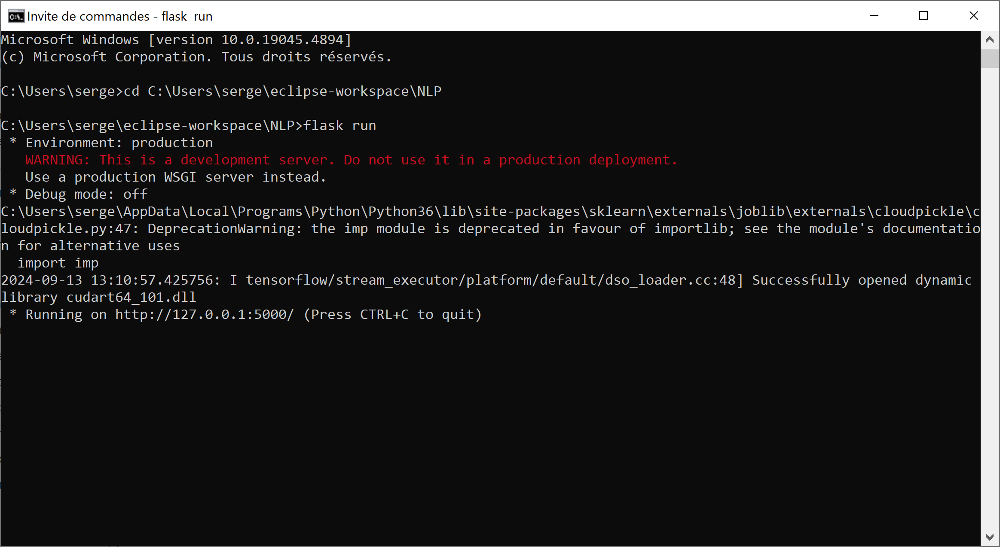
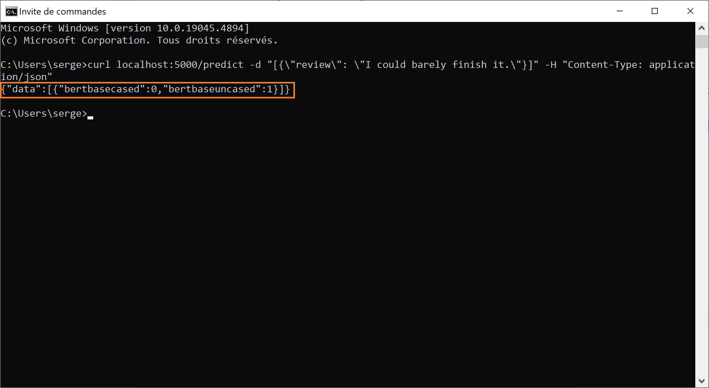
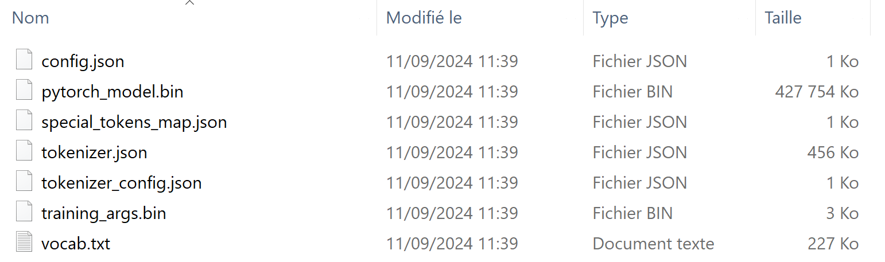

# Sentiment Analysis
# About

This repository contains a sentiment analysis solution template. `NLP.py` implements training/testing and (batch) predicting. `app.py` implements a Flask endpoint definition for sending sentiment prediction requests corresponding to ad-hoc reviews. `curl.txt` contains examples of sentiment prediction requests.

The file `IMDB-trainvalidate.csv` used for model training is based on the well-known IMDB extract with 50000 reviews - with the first 100 reviews removed (those 100 reviews can be found in the `IMDB-test.csv file` used for batch predicting).

# Acknowledgements

The following repository has been an accelerator: [https://github.com/haldersourav/imdb-nlp-sentiment](https://github.com/haldersourav/imdb-nlp-sentiment)

In the following [video](https://youtu.be/-gyvCTBHh-0?t=1563) we explain how similar mechanisms can work autonomously. 

# Prerequisites

The following components are recommended prerequisites:

- [Python 3.6.7](https://www.python.org/downloads/release/python-367/)
- [NVIDIA CUDA Toolkit 10.1](https://developer.nvidia.com/cuda-10.1-download-archive-base)
- [NVIDIA cuDNN](https://developer.nvidia.com/cudnn)

# Installation

(1) Clone/download/unzip this repository in the working folder of your choice (you must have read, write and execute rights in it).

(2) Optional: set up a Python environment to isolate this project. We did not set up an environment while developing this project (published as developed).

(3) Using the OS terminal, navigate to the working folder and type: `pip install -r requirements.txt`. The requirements contain a somewhat broader list of Python libraries than the ones used in this project - but nothing excessive.

(4) Unzip into the working folder the `IMDB-trainvalidate.zip` archive. Recommendation: keep the archive, just in case.

(5) Unzip into the `bert-base-cased` subfolder of the working folder the `pytorch_model.zip` archive (represented by multiple volumes). Recommendation: keep the archive's volumes, just in case.

(6) Unzip into the `bert-base-uncased` subfolder of the working folder the `pytorch_model.zip` archive (represented by multiple volumes). Recommendation: keep the archive's volumes, just in case.

(7) Substitute the `C:\Users\serge\eclipse-workspace\NLP\` strings in `NLP.py` and `app.py` with the OS path to your working folder.

# Running
## Ad-hoc sentiment prediction requests

(1) Open an OS terminal session, navigate to your working folder and start Flask in it (change the path to match your working folder):

 `cd C:\Users\serge\eclipse-workspace\NLP`
 
 `flask run`
 
 
 
 (2) Open another (separate from the previous) OS terminal session and type (or copy/paste another example from `curl.txt`) a sentiment prediction request (press Enter to send the request to Flask):
 
 `curl localhost:5000/predict -d "[{\"review\": \"I could barely finish it.\"}]" -H "Content-Type: application/json"` 

(3) Review the response returned by Flask:

## Batch sentiment prediction

(1) Execute the following portions from `NLP.py`:

- Python library imports
- `# Common steps and functions`
- `# Predicting`

(2) While executing the above code, you will generate the following visuals:

- Sentiment category distribution in the review batch:

- Accuracy metrics for the base uncased BERT model (`bertbaseuncased`):

- Accuracy metrics for the base cased BERT model (`bertbasecased`):

(3) Once the above code has been executed, you will find the labels predicted by each of the two models in the following file (change the path to match your working folder):

- `C:\Users\serge\eclipse-workspace\NLP\IMDB-results.csv`:

## Training and testing of sentiment models

IMPORTANT: before running the code mentioned below, please (a) make sure that your CUDA components are installed (see Prerequisites) and (b) you have enough time for training the models (in our case, using a 10% sample of the total training data, it took around 9 hours to train one model).

(1) Execute the following portions from `NLP.py`:

- Python library imports
- `# Common steps and functions`
- `# Training/testing`

(2) While executing the above code, you will generate the following visuals:

- Sentiment category distribution in the training dataset:

(3) Once the above code has been executed, you will find the two saved models in the following subfolders (change the path to match your working folder):

- `C:\Users\serge\eclipse-workspace\NLP\bert-base-cased`
- `C:\Users\serge\eclipse-workspace\NLP\bert-base-uncased`

